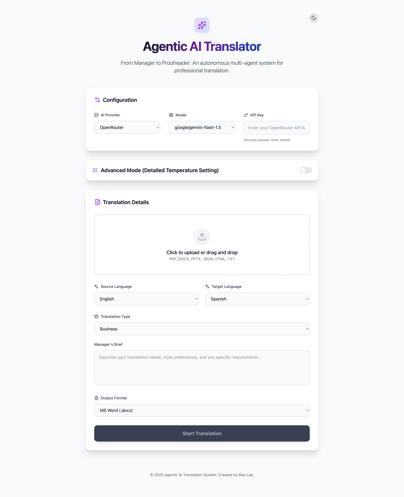
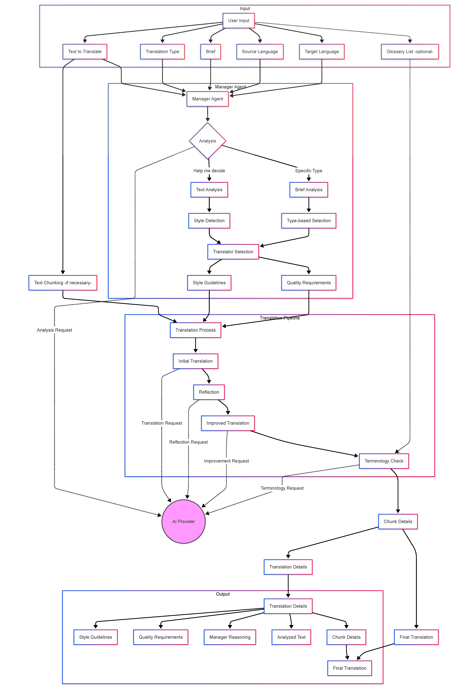

# Agentic AI Translation System with Specialized Translators and Editors

<div align="center">
  
</div>

An advanced translation system that uses multiple AI agents to provide high-quality, context-aware translations across various domains. This virtual translation company leverages specialized AI agents to deliver professional translation services.

## Acknowledgments

This project was inspired by [Andrew Ng's Translation Agent](https://github.com/andrewyng/translation-agent), which demonstrates the power of agentic workflows in machine translation. I am grateful to Andrew Ng and his collaborators for their pioneering work in this field.

## Interface Preview



## Quick Start

1. **Clone the Repository**

   ```bash
   git clone https://github.com/Max-Lee-explore/agentic-ai-translation-company.git
   cd agentic-ai-translation-company
   ```

2. **Install Backend Dependencies**

   ```bash
   cd backend

   # Create a virtual environment (recommended)
   python -m venv venv

   # Activate virtual environment
   # On Windows:
   venv\Scripts\activate
   # On macOS/Linux:
   source venv/bin/activate

   # Install Python dependencies
   pip install -r requirements.txt

   cd ..
   ```

3. **Install Frontend Dependencies**

   ```bash
   cd frontend
   npm install
   cd ..
   ```

4. **Start the Application**

   Open **two separate terminal windows**:

   **Terminal 1 - Backend Server:**

   ```bash
   cd backend
   source venv/bin/activate  # On Windows: venv\Scripts\activate
   uvicorn main:app --reload
   ```

   ✓ Backend API will run at http://localhost:8000

   **Terminal 2 - Frontend Server:**

   ```bash
   cd frontend
   npm run dev
   ```

   ✓ Frontend will run at http://localhost:5173

5. **Configure and Use**

   - Open http://localhost:5173 in your browser
   - You'll see a modern interface with light/dark mode toggle
   - **In the Configuration section**, enter:
     - **API Key**: Get from [OpenAI](https://platform.openai.com), [Anthropic](https://www.anthropic.com), [Google AI](https://ai.google.dev), [OpenRouter](https://openrouter.ai), or [xAI](https://x.ai)
     - **AI Provider**: Select your provider (OpenRouter, OpenAI, Anthropic, Google, xAI)
     - **Model**: Choose a model from the dropdown or enter a custom model ID
   - **(Optional) Enable Advanced Mode** for individual temperature controls per translator type
   - Upload your file, select languages, and start translating!

## Features

### Specialized Translation Agents

- **Manager Agent** (Temperature: 0.7)

  - Analyzes content and selects appropriate translator
  - Coordinates the translation pipeline
  - Provides detailed reasoning for decisions
  - Sets specific guidelines for each translation
  - Ensures quality and consistency across translations
  - Manages terminology and style guidelines
  - Handles complex translation requirements
  - Makes intelligent decisions about translation approach

- **Literary Translator** (Temperature: 0.8)

  - Preserves artistic and emotional qualities
  - Maintains metaphors and cultural references
  - Ensures natural flow in target language

- **Legal Translator** (Temperature: 0.65)

  - Ensures precise legal terminology
  - Maintains formal and professional tone
  - Preserves exact meaning of legal concepts

- **News Translator** (Temperature: 0.7)

  - Maintains journalistic style and accuracy
  - Preserves news value and immediacy
  - Adapts cultural references appropriately

- **Academic Translator** (Temperature: 0.7)

  - Maintains academic rigor and precision
  - Preserves technical terminology
  - Ensures consistency in academic writing

- **Technical Translator** (Temperature: 0.65)

  - Maintains technical accuracy
  - Preserves technical specifications
  - Ensures clarity of instructions

- **Medical Translator** (Temperature: 0.6)

  - Maintains medical terminology accuracy
  - Ensures patient safety
  - Preserves clinical precision

- **Marketing Translator** (Temperature: 0.8)

  - Maintains brand voice and impact
  - Adapts content for cultural markets
  - Preserves marketing effectiveness

- **Business Translator** (Temperature: 0.7)

  - Maintains professional tone
  - Preserves business terminology
  - Ensures cultural appropriateness

- **Master Translator** (Temperature: 0.7)
  - Adapts to specific requirements
  - Handles complex translation needs
  - Provides flexible translation approach

### Intelligent Translation Pipeline

1. **Initial Translation**

   - Uses specialized translator based on content type
   - Applies domain-specific guidelines
   - Maintains context and style

2. **Reflection**

   - Analyzes translation quality
   - Identifies potential improvements
   - Considers cultural context

3. **Improvement**

   - Implements suggested improvements
   - Enhances translation quality
   - Maintains consistency

4. **Terminology Check**
   - Verifies specialized terminology
   - Ensures consistency
   - Applies terminology guidelines

### Smart Decision Making

- **"Help me to decide" Option**
  - Analyzes text content automatically
  - Selects appropriate translator
  - Provides detailed reasoning
  - Sets specific guidelines

### File Support

- **Input Formats**

  - PDF (.pdf)
  - Microsoft Word (.docx)
  - Microsoft PowerPoint (.pptx)
  - JSON (.json)
  - HTML (.html)
  - Plain Text (.txt, .md)

- **Terminology List Formats**
  - CSV (.csv)
  - JSON (.json)
  - Excel (.xlsx, .xls)
  - Text (.txt)

## Usage

1. **Select Translation Type**

   - Choose from specialized translators
   - Use "Help me to decide" for automatic selection
   - Provide brief for specific requirements

2. **Upload Files**

   - Upload document to translate
   - Optionally upload terminology list
   - Select source and target languages

3. **Review Results**
   - Get translated document
   - View translation details
   - Check manager's reasoning

## Technical Details

### Architecture

- **Specialized Translators**: Domain-specific translation agents
- **Manager Agent**: Decision-making and analysis
- **Translation Pipeline**: Multi-step quality assurance
- **Terminology Handler**: Consistent terminology management



### Temperature Settings

- Creative Content (0.8): Literary, Marketing
- Balanced (0.7): News, Academic, Business
- Technical (0.65): Technical, Legal
- Precision (0.6): Medical

## Requirements

- Python 3.8+
- Required packages (see requirements.txt)
- API key from AI provider

## Development

### Project Structure

```
agentic-ai-translation-company/
├── app.py                      # Main application file with Gradio interface
├── manager_agent.py            # Manager agent implementation
├── specialized_translators.py  # All specialized translator implementations
├── translation_agents.py       # Translation pipeline and agent coordination
├── file_handlers.py            # File processing and management
├── terminology_handler.py      # Terminology management and validation
├── utils.py                    # Utility functions and helpers
├── requirements.txt            # Project dependencies
├── .env.example                # Example environment configuration
├── LICENSE                     # Project license
└── README.md                   # Project documentation
```

## Contributing

Contributions are welcome! Please feel free to submit a Pull Request.

## License

This project is licensed under a custom non-commercial license that requires attribution. See the [LICENSE](LICENSE) file for details.

Key License Terms:

- Non-commercial use only
- Attribution required
- No commercial distribution
- Modifications must be marked
- Contact author for commercial licensing

For commercial use or licensing inquiries, please contact the author.

## Author

- **Max Lee**
  - GitHub: [Max-Lee-explore](https://github.com/Max-Lee-explore)
  - Project: [Agentic AI Translation Company](https://github.com/Max-Lee-explore/agentic-ai-translation-company)
